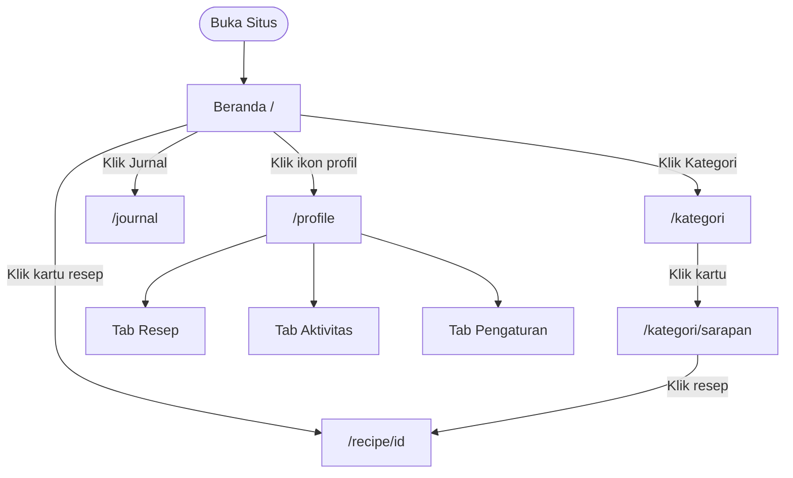

# 🍳 Dapur Nusantara — Simple Guide

> Baca dalam 5 menit. Semua yang perlu diketahui tentang proyek ini.

---

## Stack

| | |
|---|---|
| **Framework** | Next.js 16 App Router |
| **Bahasa** | TypeScript + JSX |
| **Styling** | CSS Modules (`.module.css`) — tidak ada Tailwind |
| **Animasi** | Framer Motion + GSAP + Lottie + CSS murni |
| **Data** | File TypeScript statis — tidak ada backend/DB |
| **Deploy** | Vercel (lokal: `npm run dev`) |

---

## Halaman & Fitur

| Rute | Tipe | Isi Utama |
|---|---|---|
| `/` | Server | Hero (BlurText, CardSwap, CountUp), Grid 5 Resep |
| `/kategori` | Server + Client | 8 kartu Bento (GSAP), RotatingText, Newsletter |
| `/recipe/[id]` | Server | Detail resep: bahan checkbox, langkah bernomor, SEO auto |
| `/journal` | Server | Tabel planner mingguan + TiltedCard 3D + sidebar resep |
| `/profile` | Client | 3 tab: Resep Tersimpan, Aktivitas, Pengaturan |

---

## Struktur Folder

```
app/
├── layout.tsx        ← NavBar + Footer dipasang di sini (persisten)
├── page.tsx          ← Beranda (/)
├── kategori/         ← /kategori + sub-komponen (CategoryGrid, HeroTitle, dll)
├── journal/          ← /journal: perencana makan
├── profile/          ← /profile: 3 tab + Icons.tsx SVG custom
├── recipe/[id]/      ← /recipe/[id]: detail resep dinamis + not-found.tsx
├── components/       ← Semua komponen UI (28 file)
│   ├── PageLoader.tsx  ← Loading screen animasi Lottie
│   └── ...
└── data/
    ├── recipes.ts    ← 5 resep (tambah di sini)
    └── categories.ts ← 8 kategori (tambah di sini)
```

---

## Alur Pengguna



---

## Server vs Client

Aturan simpel:
- **Default** → Server Component (HTML dikirim server, cepat)
- **Ada `useState`, animasi, event handler** → tambah `'use client'`

| Server | Client |
|---|---|
| layout.tsx, semua `page.tsx` | NavBar, HeroSection, CategoryGrid |
| Footer.tsx | TiltedCard, RecipeDetailModal |
| recipe/[id]/page.tsx | GooeyNav, profile/page.tsx |

---

## Animasi — Siapa Pakai Apa

| Halaman | Komponen Animasi | Library |
|---|---|---|
| Semua (layout) | PageLoader (loading screen) | @lottiefiles/dotlottie-react |
| NavBar | GooeyNav (partikel cair) | CSS + DOM injection |
| Beranda | BlurText, CardSwap, CountUp | Framer Motion |
| Kategori | RotatingText, CategoryGrid | GSAP ScrollTrigger |
| Jurnal | TiltedCard (3D hover) | Framer Motion |
| Profile | Transisi tab | CSS transition |

---

## Data

```
data/recipes.ts    → RECIPES[]         → RecipesSection, /recipe/[id]
data/categories.ts → CATEGORIES[]      → /kategori
journal/page.tsx   → SCHEDULE[]        → Inline hardcoded (statis)
profile/page.tsx   → SAVED_RECIPES[]   → Inline hardcoded (statis)
                     ACTIVITIES[]
```

**Interface `RecipeData`:**  `id`, `title`, `tag`, `tags[]`, `rating`, `prepTime`, `cookTime`, `servings`, `calories`, `src`, `heroSrc`, `ingredients[]`, `steps[]`, `author`

**Interface `CategoryData`:** `id`, `name`, `emoji`, `color`, `colorEnd`, `recipeCount`, `featuredTag`

---

## Mobile vs Desktop

| Elemen | Desktop | Mobile |
|---|---|---|
| NavBar | GooeyNav horizontal | Hamburger → overlay GooeyNav |
| Hero | 2 kolom + CardSwap | 1 kolom (CardSwap hidden) |
| Resep Grid | 2 kolom masonry | 1 kolom |
| Kategori | 4 kolom bento | 2 kolom |
| Profile tabs | Normal | Horizontal scroll |
| Planner | Tabel 4 kolom | Horizontal scroll |

---

## Cara Menambah Konten

**Resep baru** → tambah objek ke `RECIPES[]` di `data/recipes.ts`  
**Kategori baru** → tambah objek ke `CATEGORIES[]` di `data/categories.ts`  
**Halaman baru** → buat `app/nama/page.tsx` → daftarkan ke `NAV_ITEMS` di `NavBar.tsx`

---

## Perintah Terminal

```bash
npm run dev     # Development (localhost:3000)
npm run build   # Build produksi
npm run start   # Jalankan build
```
