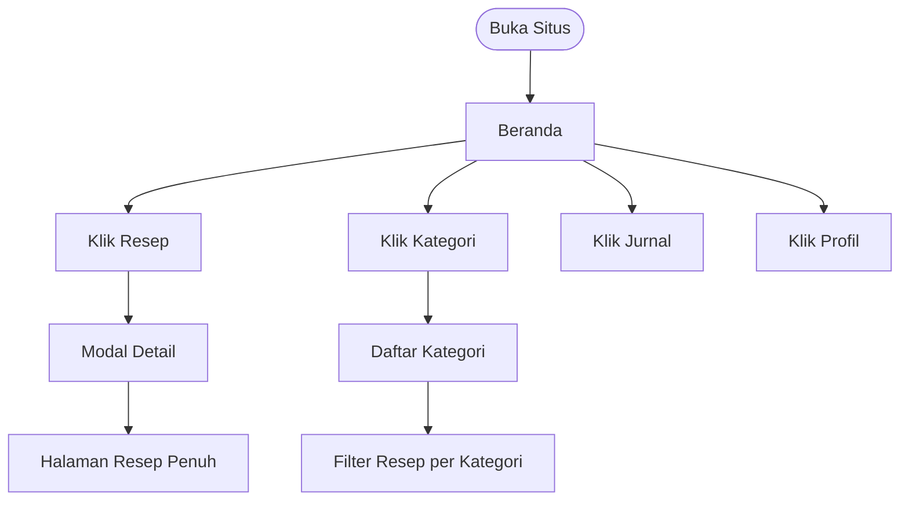
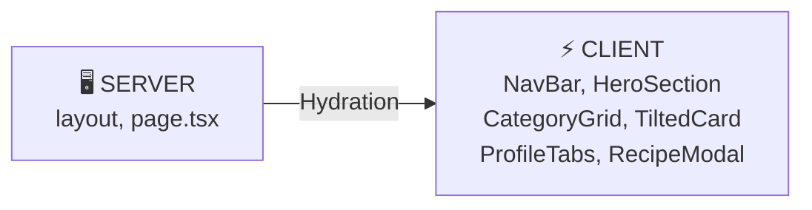

# 🍳 Dapur Nusantara — Simple Guide

> Panduan cepat memahami proyek ini dalam 5 menit.

---

## Stack

| | |
|---|---|
| **Framework** | Next.js 16 App Router |
| **Styling** | CSS Modules (`.module.css`) |
| **Animasi** | Framer Motion + GSAP + CSS |
| **Data** | File TypeScript statis (tidak ada backend/DB) |
| **Deploy** | Vercel (via `npm run dev` untuk lokal) |

---

## Struktur Folder Penting

```
app/
├── layout.tsx        ← NavBar + Footer dipasang di sini (persisten)
├── page.tsx          ← Beranda (/)
├── kategori/         ← Halaman kategori (/kategori)
├── journal/          ← Perencana makan mingguan (/journal)
├── profile/          ← Profil pengguna (/profile)
├── recipe/[id]/      ← Detail resep dinamis (/recipe/chicken)
├── components/       ← Semua komponen UI
└── data/
    ├── recipes.ts    ← 5 resep (tambah di sini)
    └── categories.ts ← 8 kategori (tambah di sini)
```

---

## Alur Halaman



---

## Server vs Client



Aturan sederhana:
- **Tidak butuh interaksi?** → Biarkan jadi Server Component (default)
- **Butuh `useState`, animasi, event handler?** → Tambahkan `'use client'` di baris pertama

---

## Cara Menambah Konten

**Resep baru** → Edit `app/data/recipes.ts`, tambah objek ke array `RECIPES`

**Kategori baru** → Edit `app/data/categories.ts`, tambah objek ke array `CATEGORIES`

**Halaman baru** → Buat `app/nama-halaman/page.tsx`, lalu tambahkan ke `NAV_ITEMS` di `NavBar.tsx`

---

## Menjalankan Proyek

```bash
npm run dev     # Development (localhost:3000)
npm run build   # Build production
npm run start   # Jalankan production build
```

---

## Komponen Animasi Mana di Halaman Mana?

| Halaman | Animasi |
|---|---|
| Beranda | `BlurText`, `CardSwap`, `CountUp`, `RotatingText` |
| Kategori | `GSAP ScrollTrigger` (kartu melayang), `RotatingText` |
| Jurnal | `TiltedCard` (efek 3D Framer Motion) |
| NavBar | `GooeyNav` (efek partikel cair, desktop + mobile) |
