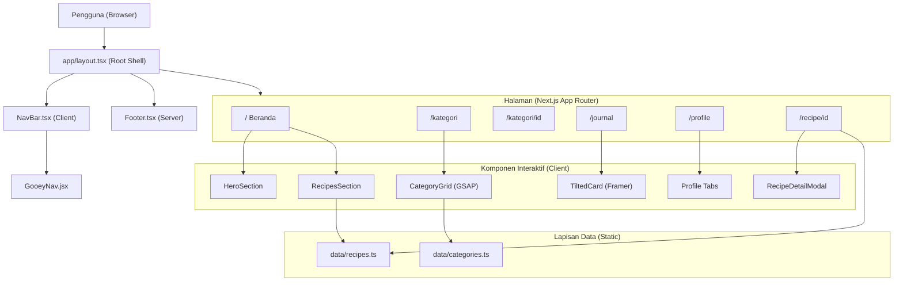
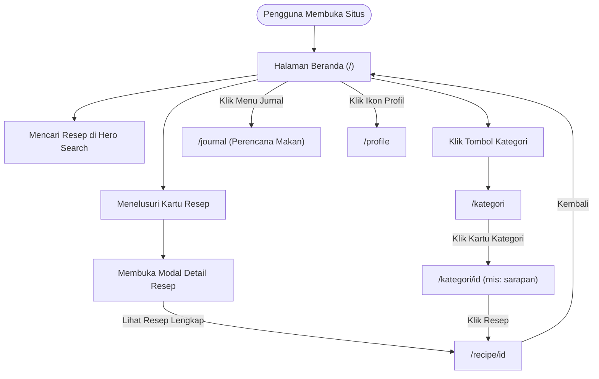
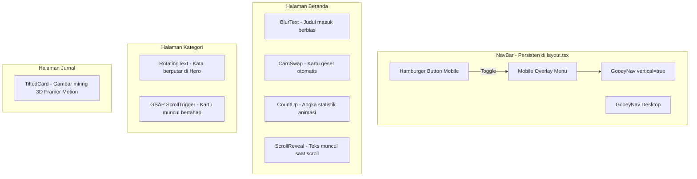
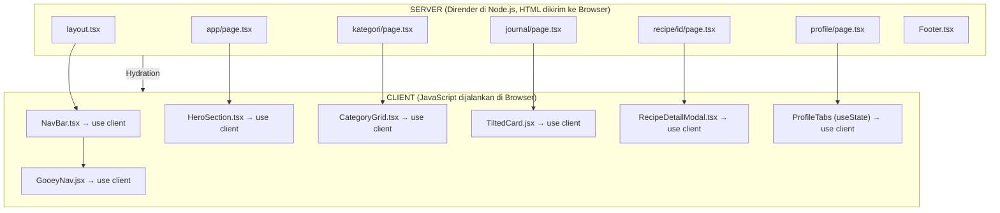
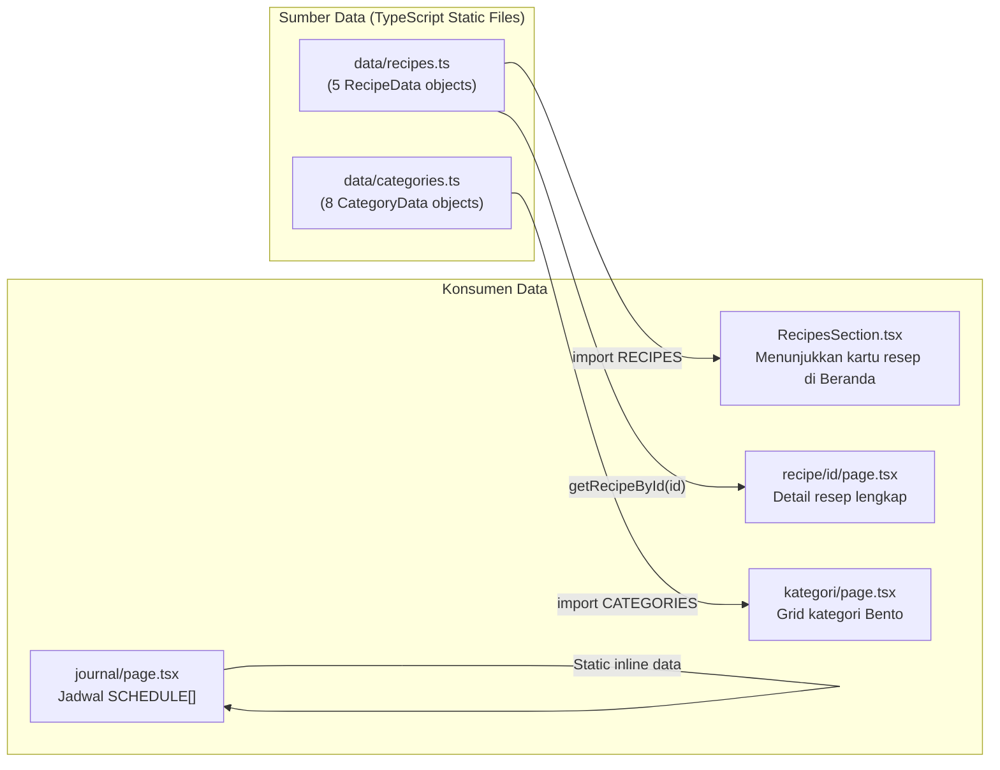
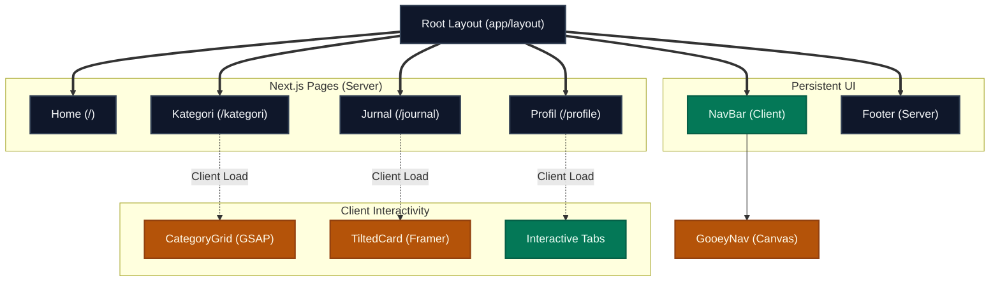

# 📖 Panduan Teknis & Arsitektur — Dapur Nusantara

Dokumen ini adalah panduan lengkap yang menjelaskan struktur folder, alur pengguna (*user journey*), arsitektur sistem, dan keputusan teknis di balik pengembangan situs **Dapur Nusantara**.

---

## 🏗 Tech Stack

| Lapisan | Teknologi | Peran |
|---|---|---|
| **Framework** | Next.js 16 (App Router) | Rendering, routing, optimasi SEO |
| **Bahasa** | TypeScript + JSX | Type-safety dan komponen interaktif |
| **Styling** | CSS Modules + Global CSS | Isolasi gaya per komponen |
| **Animasi** | Framer Motion, GSAP, CSS | Animasi berbasis fisika dan scroll |
| **Font** | Google Fonts (Inter) | Tipografi modern lewat `next/font` |
| **Build Tool** | Turbopack (bawaan Next.js 16) | Kompilasi lebih cepat dari Webpack |
| **Data** | Static TypeScript Files | `data/recipes.ts`, `data/categories.ts` |

---

## 📁 Struktur Folder

```
frontend-resep/
└── app/
    ├── layout.tsx              ← Root layout (NavBar + Footer persisten)
    ├── globals.css             ← Token desain global (warna, font, spacing)
    ├── page.tsx                ← Halaman Beranda (/)
    │
    ├── components/             ← Komponen UI yang dapat digunakan ulang
    │   ├── NavBar.tsx          ← Navigasi utama (Client, animasi GooeyNav)
    │   ├── GooeyNav.jsx        ← Efek navigasi partikel cair
    │   ├── HeroSection.tsx     ← Hero beranda (BlurText, CardSwap)
    │   ├── RecipesSection.tsx  ← Grid resep bergaya Masonry
    │   ├── RecipeDetailModal.tsx ← Modal detail resep (Client)
    │   ├── TiltedCard.jsx      ← Kartu animasi 3D (Framer Motion)
    │   ├── Footer.tsx          ← Footer situs
    │   └── [lainnya]           ← BlurText, SplitText, CountUp, dll
    │
    ├── data/
    │   ├── recipes.ts          ← Data statis semua resep (5 resep)
    │   └── categories.ts       ← Data statis semua kategori (8 kategori)
    │
    ├── kategori/
    │   ├── page.tsx            ← Halaman daftar semua kategori (/kategori)
    │   ├── CategoryGrid.tsx    ← Grid kategori Bento + GSAP ScrollTrigger
    │   └── [id]/page.tsx       ← Halaman detail per kategori
    │
    ├── journal/
    │   └── page.tsx            ← Halaman Jurnal Mingguan (/journal)
    │
    ├── profile/
    │   └── page.tsx            ← Halaman Profil dengan Tab (/profile)
    │
    └── recipe/
        └── [id]/page.tsx       ← Halaman detail resep dinamis (/recipe/chicken)
```

---

## 🎨 Mengapa CSS Modules?

### 1. Isolasi Scope Mutlak
Dengan CSS Modules, nama kelas seperti `.card` di-*hash* menjadi sesuatu seperti `page_card__Xj3K` saat kompilasi. Tidak ada tabrakan nama antar komponen meski menggunakan nama yang sama.

### 2. Zero-Runtime Performance
CSS Modules dikompilasi menjadi file `.css` statis oleh Next.js. Tidak ada overhead JavaScript saat di-*render* seperti CSS-in-JS (Styled-Components, Emotion).

### 3. Code Splitting Otomatis
Next.js hanya memuat CSS dari halaman yang sedang dibuka. CSS `/profile` tidak akan diunduh ketika pengguna membuka `/kategori`.

### 4. Cocok untuk Animasi Kompleks
Animasi `GooeyNav` menggunakan filter SVG kompleks dan variabel CSS kustom (`--color-1`, `--time`, dll). Kontrol tingkat rendah ini hanya mudah dilakukan dengan CSS mentah, bukan *utility classes*.

---

## 🔄 Diagram Alur Sistem (System Architecture)



---

## 🧭 Diagram Perjalanan Pengguna (User Journey)



---

## 🎬 Diagram Alur Animasi



---

## ⚙️ Alur Server Component vs Client Component



---

## 📊 Alur Data Statis



---

> [!TIP]
> **Cara Menambah Halaman Baru**  
> Cukup buat folder baru di `app/nama-halaman/page.tsx`. NavBar dan Footer otomatis terpasang dari `layout.tsx`. Tambahkan rute baru ke array `NAV_ITEMS` di `NavBar.tsx` untuk integrasi animasi GooeyNav.

> [!NOTE]
> **Cara Menambah Resep Baru**  
> Tambahkan objek baru ke array `RECIPES` di `app/data/recipes.ts` mengikuti interface `RecipeData`. Resep baru akan otomatis muncul di `RecipesSection` dan dapat diakses lewat URL `/recipe/[id]`.


Dokumen ini adalah panduan teknis lengkap yang menjelaskan alur kerja (*flow*), arsitektur, dan keputusan teknis di balik pengembangan situs **Dapur Nusantara**. 

---

## 🏗 Arsitektur Utama (Tech Stack)

Situs ini dibangun dengan ekosistem modern berbasis React:
- **Framework Utama:** [Next.js](https://nextjs.org/) (App Router) dengan TypeScript.
- **Styling:** CSS Modules bawaan Next.js (`*.module.css`) dipadukan dengan variabel CSS global (`globals.css`).
- **Animasi:** Kombinasi antara [Framer Motion](https://motion.dev/) (alias `motion/react`), [GSAP](https://gsap.com/) (ScrollTrigger), dan transisi CSS murni.

---

## 🎨 Mengapa Menggunakan CSS Modules (`.module.css`)?

Sering kali proyek modern menggunakan TailwindCSS atau Styled-Components. Namun, di proyek ini kita secara ketat menggunakan **CSS Modules Vanilla**. Berikut adalah alasan teknisnya:

### 1. Isolasi Scope Mutlak (*Local Scoping*)
Masalah terbesar di CSS tradisional adalah konflik nama (*class name collision*). Dengan CSS Modules, penamaan kelas seperti `.card` atau `.container` di- *hash* secara otomatis saat kompilasi (menjadi sesuatu seperti `page_card__3Xj9a`). 
- **Keuntungan:** Developer bebas menggunakan nama `.title` di 10 file yang berbeda tanpa takut gayanya akan "bocor" (bleed) atau bertabrakan antar halaman.

### 2. Kinerja Bebas Hambatan (*Zero-Runtime CSS*)
Tidak seperti *CSS-in-JS* (misal: Styled-Components atau Emotion) yang membebankan peramban (*browser*) klien untuk menerjemahkan JS ke CSS secara *real-time*, CSS Modules di- *build* oleh Next.js menjadi file `.css` statis (murni).
- **Keuntungan:** Performa sangat cepat (zero-runtime), mendukung penuh React Server Components (RSC), dan tidak memperbesar ukuran bundel *JavaScript*.

### 3. Pemisahan Kode (*Code Splitting*) Otomatis
Next.js secara otomatis hanya akan memuat file `.module.css` yang dibutuhkan pada halaman aktif.
- **Keuntungan:** Jika pengguna hanya membuka `/journal`, maka CSS dari `/kategori` tidak akan diunduh. Hal ini mempercepat waktu buka halaman secara signifikan.

### 4. Fleksibilitas Penuh untuk Animasi Kompleks
Animasi seperti `GooeyNav` (efek cair) atau kalkulasi perspektif 3D pada `TiltedCard` sangat bergantung pada pseudoelemen (`::before`, `::after`), filter SVG kompleks (`url(#gooey)`), dan variabel kustom CSS. Menggunakan murni CSS Modules mempermudah manipulasi properti tingkat lanjut ini dibandingkan *utility classes* seperti Tailwind.

---

## 🔄 Alur Teknis & Cara Kerja Website (*Technical Flows*)

Berikut adalah diagram (Flowchart) dan penjelasan teknis tentang bagaimana roda gigi website ini bergerak:

### Diagram Arsitektur (Flowchart)


### 1. Alur Render & Layout (App Router Flow)
Website ini sepenuhnya menggunakan arsitektur **App Router (`app/`)** Next.js.
- **`app/layout.tsx`**: Bertindak sebagai pembungkus (cangkang) aplikasi. Komponen `<NavBar />` dan `<Footer />` dipanggil di sini.
- **Kenapa ini penting?** Saat pengguna berpindah halaman dari `/` ke `/kategori` menggunakan `<Link>`, React hanya mengganti komponen utama (halaman). Komponen `<NavBar />` tidak dihancurkan (*unmounted*) dan dirender ulang, melainkan **tetap persisten di memori**. Itulah sebabnya animasi efek cair (*gooey*) pada navigasi tidak terputus dan bisa bergerak mulus antar *tab*.

### 2. Alur Animasi Hibrida (*Animation Flow*)
Situs ini menerapkan "Progressive Enhancement" pada animasinya, memadukan berbagai alat beda spesialisasi:
- **GSAP (GreenSock):** Digunakan pada halaman *Kategori* untuk menganimasikan kartu-*kartu bento* secara bergelombang (*stagger*) saat pengguna melakukan *scroll* (`ScrollTrigger`). GSAP sangat unggul untuk animasi terkoordinasi berskala besar berbasis gulir.
- **Framer Motion (`motion`):** Digunakan pada *TiltedCard* di halaman *Jurnal*. Komponen ini melacak kordinat sentuhan *mouse* secara lokal menggunakan `useMotionValue` dan `useSpring`, untuk menghasilkan efek interaktif berbobot fisika secara halus.
- **Kanvas CSS/SVG (`GooeyNav`):** Menggunakan injeksi dinamis dari `document.createElement` (JavaScript mentah) yang dikombinasikan dengan `<filter id="gooey">`. Setiap kali menu diklik, ia menembakkan "partikel" secara radial menggunakan fungsi matematika Kosinus & Sinus (`getXY`).

### 3. Alur Komponen Server vs Klien (*RSC vs Client Boundaries*)
Secara *default*, semua file di *App Router* adalah **Server Components**.
- **Server:** Halaman-halaman dibiarkan menjadi Server Component, artinya mereka dirakit di sisi *server* dan dikirim ke klien (browser) sebagai HTML statis murni.
- **Client:** Jika sebuah komponen membutuhkan interaktivitas (seperti melacak *mouse*, menggunakan `useState`, atau efek animasi saat *scroll*), kita memisahkannya ke dalam komponen spesifik (misal: `NavBar.tsx`, `CategoryGrid.tsx`, `TiltedCard.jsx`) dan memberinya label pembuka `'use client';`.
- **Hasil:** Aplikasi terasa sangat interaktif, tetapi *bundle* JavaScript yang harus diunduh *browser* tetap sangat ramping.

### 4. Alur Mode Responsif (*Mobile Flow*)
Website dirancang dengan prinsip desain fleksibel:
- Menggunakan `clamp()` pada CSS (contoh: `font-size: clamp(2rem, 5vw, 3.5rem);`) yang membuat ukuran teks otomatis menyusut mengikuti ukuran layar tanpa perlu ratusan *Media Queries*.
- Grid dirancang menggunakan `grid-template-columns: repeat(auto-fill, minmax(280px, 1fr))` sehingga kartu resep otomatis tumpah ke bawah membentuk 1 kolom saat layar mengecil ke ukuran ponsel.
- Di layar *mobile*, efek interaktif berat (seperti GooeyNav) disembunyikan menggunakan `@media`, digantikan oleh *Hamburger Menu* berbasis state React (`mobileMenuOpen`) untuk mempercepat kinerja perenderan pada ponsel.

---

> [!TIP]
> **Praktik Terbaik Pemeliharaan (Maintenance)**  
> Jika Anda di masa depan ingin menambahkan halaman baru, cukup buat *folder* baru di dalam direktori `app/` (contoh: `app/tentang-kami/page.tsx`). Jangan lupa untuk menambahkan tautan rute barunya ke parameter `NAV_ITEMS` di `app/components/NavBar.tsx` agar langsung terintegrasi dengan animasi navigasi!
