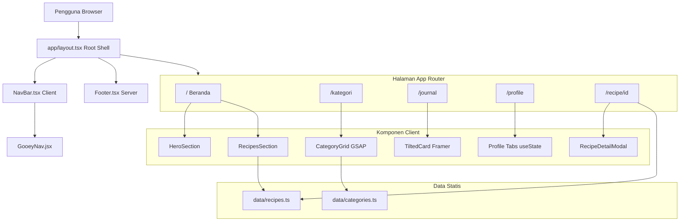
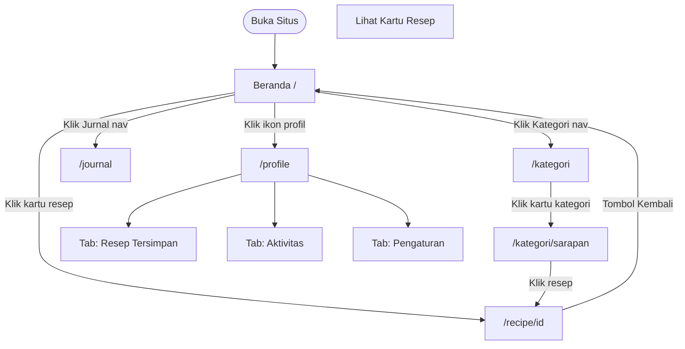
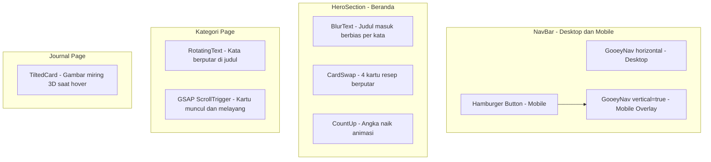
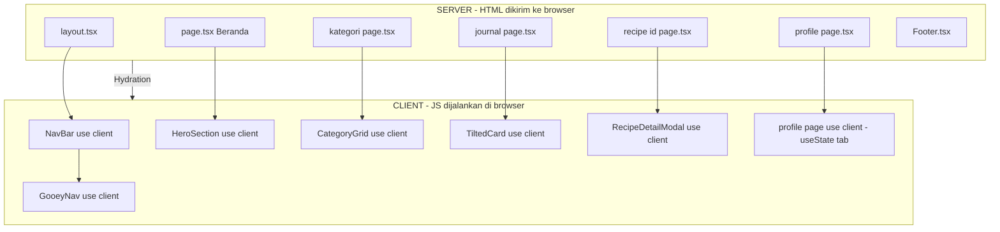
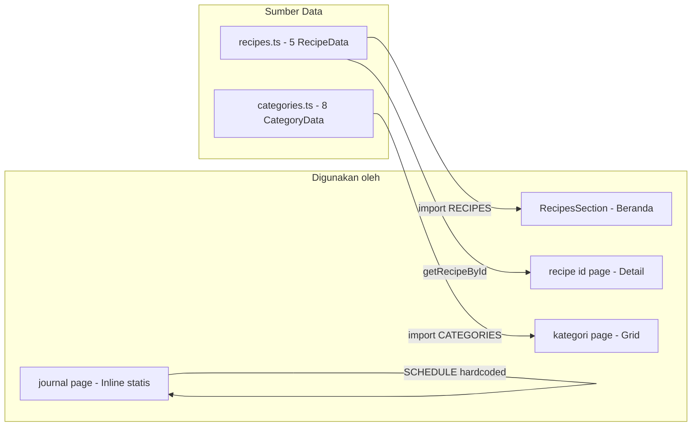

# 📖 Panduan Teknis & Arsitektur — Dapur Nusantara

Panduan lengkap berdasarkan kode asli proyek. Mencakup semua halaman, komponen, data, animasi, dan alur sistem.

---

## 🏗 Tech Stack

| Lapisan | Teknologi | Peran |
|---|---|---|
| **Framework** | Next.js 16 (App Router) | Rendering, routing, SEO |
| **Bahasa** | TypeScript + JSX | Type-safety dan komponen interaktif |
| **Styling** | CSS Modules + Global CSS | Isolasi gaya per komponen |
| **Animasi** | Framer Motion, GSAP, CSS | Animasi fisika dan scroll |
| **Font** | Inter via `next/font/google` | Tipografi modern |
| **Build Tool** | Turbopack (Next.js 16) | Kompilasi lebih cepat |
| **Data** | Static TypeScript files | Tidak ada backend/DB |

---

## 📁 Struktur Folder Lengkap

```
frontend-resep/
└── app/
    ├── layout.tsx              ← Root layout: NavBar + Footer persisten di semua halaman
    ├── globals.css             ← CSS Variables global (warna, spacing, font)
    ├── page.tsx                ← Beranda (/)
    │
    ├── components/             ← Semua komponen UI
    │   ├── NavBar.tsx          ← Navigasi + hamburger mobile
    │   ├── NavBar.module.css
    │   ├── GooeyNav.jsx        ← Efek partikel cair + routing
    │   ├── GooeyNav.css
    │   ├── HeroSection.tsx     ← Section hero beranda
    │   ├── HeroSection.module.css
    │   ├── RecipesSection.tsx  ← Grid masonry resep
    │   ├── RecipesSection.module.css
    │   ├── RecipeDetailModal.tsx ← Modal slide-up detail resep
    │   ├── RecipeDetailModal.module.css
    │   ├── TiltedCard.jsx      ← Kartu gambar animasi 3D
    │   ├── TiltedCard.css
    │   ├── Footer.tsx
    │   ├── Footer.module.css
    │   ├── BlurText.jsx        ← Teks muncul dengan blur per kata
    │   ├── SplitText.jsx       ← Teks muncul karakter per karakter
    │   ├── CardSwap.jsx        ← Kartu yang berputar bergantian
    │   ├── CardSwap.css
    │   ├── CountUp.jsx         ← Angka animasi naik
    │   ├── RotatingText.jsx    ← Teks berputar (kata berganti)
    │   ├── RotatingText.css
    │   ├── ScrollReveal.jsx    ← Teks muncul saat di-scroll
    │   ├── ScrollReveal.css
    │   ├── TextPressure.jsx    ← Font berubah berat saat hover
    │   └── QuoteSection.tsx    ← Section quote di beranda
    │
    ├── data/
    │   ├── recipes.ts          ← 5 resep statis (RecipeData[])
    │   └── categories.ts       ← 8 kategori statis (CategoryData[])
    │
    ├── kategori/
    │   ├── page.tsx            ← /kategori: listing semua kategori
    │   ├── page.module.css
    │   ├── CategoryGrid.tsx    ← Grid bento + GSAP
    │   ├── HeroStats.tsx       ← Statistik di hero kategori
    │   ├── HeroTitle.tsx       ← Judul dengan RotatingText
    │   ├── HeroSubtitle.tsx
    │   └── NewsletterForm.tsx  ← Form langganan newsletter
    │
    ├── journal/
    │   ├── page.tsx            ← /journal: perencana makan mingguan
    │   └── page.module.css
    │
    ├── profile/
    │   ├── page.tsx            ← /profile: profil pengguna (3 tab)
    │   ├── page.module.css
    │   └── Icons.tsx           ← Kumpulan icon SVG custom
    │
    └── recipe/
        ├── layout.tsx          ← Layout khusus halaman resep
        ├── not-found.tsx       ← Halaman 404 untuk resep tidak ditemukan
        └── [id]/
            ├── page.tsx        ← /recipe/[id]: detail resep dinamis
            └── page.module.css
```

---

## 🎨 Mengapa CSS Modules?

| Masalah | CSS Biasa | CSS Modules |
|---|---|---|
| Tabrakan nama kelas | `.card` bisa konflik | `.card` → `page_card__Xj3K` (unik) |
| Loading CSS | Semua sekaligus | Hanya halaman aktif |
| JavaScript overhead | CSS-in-JS butuh runtime | File `.css` statis, nol overhead |
| Animasi kompleks | Sulit dengan utility | Kontrol penuh variabel CSS |

---

## 📄 Detail Setiap Halaman

### 🏠 Beranda (`/`)
**File:** `app/page.tsx`  
**Tipe:** Server Component

Komponen yang dirender:
1. **HeroSection** — Judul animasi `BlurText`, search bar, `CountUp` statistik (2400+ resep, 98% kepuasan, 12.4k pengguna), dan `CardSwap` (4 kartu resep berputar otomatis di sebelah kanan, hanya tampil di desktop ≥900px)
2. **RecipesSection** — Grid masonry 5 resep dari `data/recipes.ts`, setiap kartu bisa diklik ke halaman `/recipe/[id]`
3. **QuoteSection** — Kutipan motivasi

---

### 📂 Kategori (`/kategori`)
**File:** `app/kategori/page.tsx`  
**Tipe:** Server Component (dengan Client sub-komponen)

- **Hero** dengan gambar background, `RotatingText` (kata berputar: Sarapan, Vegan, Italia...), dan statistik animasi
- **Search bar** di dalam hero
- **CategoryGrid** (Client, GSAP) — 8 kartu kategori dalam layout **Bento Grid** (beberapa kartu besar `span 2`), animasi melayang setelah muncul dari bawah saat di-scroll
- **Popular Tags** — chip filter per tag
- **Newsletter** — form email

**8 kategori:** Sarapan, Makan Siang, Makan Malam, Cemilan, Vegan, Minuman, Roti & Kue, Italia

---

### 📋 Detail Resep (`/recipe/[id]`)
**File:** `app/recipe/[id]/page.tsx`  
**Tipe:** Server Component + `generateMetadata`

- Mengambil data dari `getRecipeById(id)` di `data/recipes.ts`
- Jika tidak ditemukan → `notFound()` → render `not-found.tsx`
- SEO: `generateMetadata` otomatis mengisi `<title>` dan `<meta description>` per resep
- Menampilkan: hero image, tags, judul, rating, deskripsi, prep/cook time, porsi, kalori, bahan-bahan interaktif (checkbox), langkah memasak bernomor

**5 resep tersedia:** `chicken`, `salad`, `bowl`, `bread`, `pizza`

---

### 📓 Jurnal (`/journal`)
**File:** `app/journal/page.tsx`  
**Tipe:** Server Component

Fitur:
- **Tabel perencana mingguan** (Sen–Jum × Sarapan/Makan Siang/Makan Malam)
- Sel yang terisi menampilkan `TiltedCard` — gambar beranimasi 3D saat di-hover
- **Sidebar Rekomendasi Musiman** — 3 resep yang bisa didrag ke jadwal (UI, belum fungsional drag)
- Tombol **"Buat Daftar Belanja"**
- Data `SCHEDULE` hardcoded (statis), `RECIPES` statis dalam file

---

### 👤 Profil (`/profile`)
**File:** `app/profile/page.tsx`  
**Tipe:** Client Component (`'use client'`, `useState`)

Tiga tab dikendalikan `useState<'RECIPES' | 'ACTIVITY' | 'SETTINGS'>`:

| Tab | Konten |
|---|---|
| **Resep Tersimpan** | 3 kartu resep dengan badge, rating, waktu |
| **Aktivitas** | Feed aktivitas (resep disimpan, komentar, pencapaian, dll) |
| **Pengaturan** | Bento grid: Informasi Pribadi, Preferensi Diet, Keamanan Akun, Notifikasi |

- Menggunakan icon SVG custom dari `profile/Icons.tsx` (tidak pakai icon font)
- Pengaturan terbagi: login sosial (Google, Facebook), toggle notifikasi, preferensi diet

---

## 🗄 Struktur Data

### `RecipeData` (dari `data/recipes.ts`)
```typescript
interface RecipeData {
  id: string;          // Digunakan sebagai URL: /recipe/[id]
  title: string;
  tag: string;         // Satu kategori utama
  tags: string[];      // Beberapa tag untuk filter
  rating: string;
  reviews: number;
  prepTime: string;
  cookTime: string;
  servings: number;
  calories: number;
  src: string;         // Gambar untuk kartu (thumbnail)
  heroSrc: string;     // Gambar besar untuk halaman detail
  description: string;
  ingredients: Ingredient[];  // { amount, name, note? }
  steps: Step[];              // { step, title, text, icon }
  author: string;
}
```

### `CategoryData` (dari `data/categories.ts`)
```typescript
interface CategoryData {
  id: string;          // Digunakan sebagai URL: /kategori/[id]
  name: string;
  description: string;
  emoji: string;
  color: string;       // Warna gradient atas
  colorEnd: string;    // Warna gradient bawah
  textColor: string;
  recipeCount: number;
  featuredTag: string;
  highlight: string;
}
```

---

## 🔄 Diagram Alur Sistem



---

## 🧭 Alur Pengguna (User Journey)



---

## 🎬 Komponen Animasi



---

## ⚙️ Server vs Client Component



---

## 📊 Alur Data



---

## 📱 Responsivitas Mobile

| Elemen | Desktop | Mobile |
|---|---|---|
| NavBar | GooeyNav horizontal | Hamburger → GooeyNav vertical overlay |
| Hero | 2 kolom (teks + CardSwap) | 1 kolom (CardSwap disembunyikan) |
| RecipesSection | 2 kolom masonry | 1 kolom |
| CategoryGrid | 4 kolom bento | 2 kolom |
| Profile tabs | Tab horizontal | Horizontal scroll (overflow-x: auto) |
| Journal planner | Tabel 4 kolom | Horizontal scroll |
| Font size | Tetap | `clamp()` otomatis menyusut |

---

## 🚀 Cara Menjalankan

```bash
npm run dev      # Development server (localhost:3000)
npm run build    # Build produksi
npm run start    # Jalankan build produksi
```

---

> [!TIP]
> **Tambah Halaman Baru**  
> Buat `app/nama/page.tsx` → NavBar & Footer otomatis terpasang dari `layout.tsx` → Tambahkan ke `NAV_ITEMS` di `NavBar.tsx`.

> [!NOTE]
> **Tambah Resep**  
> Tambah objek ke `RECIPES[]` di `data/recipes.ts` ikuti interface `RecipeData`. URL otomatis jadi `/recipe/[id]`.

> [!NOTE]
> **Tambah Kategori**  
> Tambah objek ke `CATEGORIES[]` di `data/categories.ts`. URL otomatis jadi `/kategori/[id]`.
